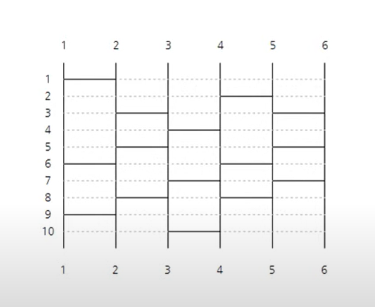

# 사다리 타기

> 출처: https://www.youtube.com/watch?v=1nL9S34qCtA

## 🔍 진행 방식

- 미션은 **기능 요구 사항, 프로그래밍 요구 사항, 과제 진행 요구 사항** 세 가지로 구성되어 있다.
- 세 개의 요구 사항을 만족하기 위해 노력한다. 특히 기능을 구현하기 전에 기능 목록을 만들고, 기능 단위로 커밋 하는 방식으로 진행한다.
- 기능 요구 사항에 기재되지 않은 내용은 스스로 판단하여 구현한다.

### 테스트 실행 가이드

- 터미널에서 `java -version`을 실행하여 Java 버전이 11인지 확인한다. 또는 Eclipse 또는 IntelliJ IDEA와 같은 IDE에서 Java 11로 실행되는지 확인한다.
- 터미널에서 Mac 또는 Linux 사용자의 경우 `./gradlew clean test` 명령을 실행하고,   
  Windows 사용자의 경우  `gradlew.bat clean test` 명령을 실행할 때 모든 테스트가 아래와 같이 통과하는지 확인한다.

```
BUILD SUCCESSFUL in 0s
```

---

## 🚀 기능 요구 사항

사다리 타기 게임 기능을 구현해야 한다. 사다리 타기 게임은 아래와 같은 규칙으로 진행된다.



- 사다리 게임은 가로선을 `(높이, 왼쪽의 세로줄 번호)` 형태로 나타낼 수 있다.
- 예를 들어 위 사다리 게임은 `(1,1), (6,1), (9,1), (3,2), (5,2), ...`와 같이 표현할 수 있다.


### 입출력 요구 사항

#### 입력

- 사다리 게임의 출발 지점을 입력 받는다. 출발 지점이 1 미만이거나 10초과 이면 오류를 발생시킨다.

```
1
```

#### 출력

- 사다리 게임의 도착 지점을 출력한다.

```
6
```

- 당첨 내역을 출력한다.


- 예외 상황 시 에러 문구를 출력해야 한다. 단, 에러 문구는 "[ERROR]"로 시작해야 한다.

```
[ERROR] 출발 지점은 1부터 10 사이의 숫자여야 합니다.
```

#### 실행 결과 예시

```
> 1
6
> 3
5
> 6
3
```

---

## 🎯 프로그래밍 요구 사항

- JDK 11 버전에서 실행 가능해야 한다. **JDK 11에서 정상적으로 동작하지 않을 경우 0점 처리한다.**
- 프로그램 실행의 시작점은 `Application`의 `main()`이다.
- `build.gradle` 파일을 변경할 수 없고, 외부 라이브러리를 사용하지 않는다.
- [Java 코드 컨벤션](https://github.com/woowacourse/woowacourse-docs/tree/master/styleguide/java) 가이드를 준수하며 프로그래밍한다.
- 프로그램 종료 시 `System.exit()`를 호출하지 않는다.
- 프로그래밍 요구 사항에서 달리 명시하지 않는 한 파일, 패키지 이름을 수정하거나 이동하지 않는다.
- indent(인덴트, 들여쓰기) depth를 3이 넘지 않도록 구현한다. 2까지만 허용한다.
    - 예를 들어 while문 안에 if문이 있으면 들여쓰기는 2이다.
    - 힌트: indent(인덴트, 들여쓰기) depth를 줄이는 좋은 방법은 함수(또는 메서드)를 분리하면 된다.
- 3항 연산자를 쓰지 않는다.
- 함수(또는 메서드)가 한 가지 일만 하도록 최대한 작게 만들어라.
- JUnit 5와 AssertJ를 이용하여 본인이 정리한 기능 목록이 정상 동작함을 테스트 코드로 확인한다.

### 추가된 요구 사항

- 함수(또는 메서드)의 길이가 15라인을 넘어가지 않도록 구현한다.
    - 함수(또는 메서드)가 한 가지 일만 잘 하도록 구현한다.
- else 예약어를 쓰지 않는다.
    - 힌트: if 조건절에서 값을 return하는 방식으로 구현하면 else를 사용하지 않아도 된다.
    - else를 쓰지 말라고 하니 switch/case로 구현하는 경우가 있는데 switch/case도 허용하지 않는다.
- Java Enum을 적용한다.
- 도메인 로직에 단위 테스트를 구현해야 한다. 단, UI(System.out, System.in, Scanner) 로직은 제외한다.
    - 핵심 로직을 구현하는 코드와 UI를 담당하는 로직을 분리해 구현한다.

## ✏️ 과제 진행 요구 사항

- **기능을 구현하기 전 `docs/README.md`에 구현할 기능 목록을 정리**해 추가한다.
- **Git의 커밋 단위는 앞 단계에서 `docs/README.md`에 정리한 기능 목록 단위**로 추가한다.
    - [커밋 메시지 컨벤션](https://gist.github.com/stephenparish/9941e89d80e2bc58a153) 가이드를 참고해 커밋 메시지를 작성한다.
